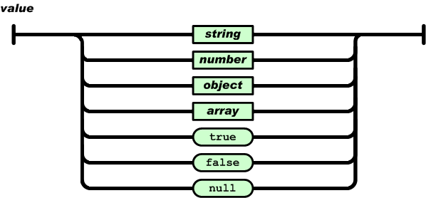

# 设备树技术源码解析 <!-- {docsify-ignore} -->

驱动与设备的关系，可以类比为函数与变量的关系，函数负责具体的执行动作，变量负责描述自身属性，两者之间是互相依存，缺一不可，通常情况下，都是一对一的关系，即一个驱动对应一个设备，但更多的时候是一对多的关系，即一个驱动对应好几个设备。比如，一颗主控芯片，集成了四个串行端口，这个时候，你不可能写四份驱动然后分别注册设备，这样显然很冗余。通常都是只写一份驱动，然后用变量描述之间的差异，分别执行四次，达到注册四个设备的目的。实际操作中，直接用变量来描述设备的属性，也显得灵活性不够。每添加一个设备，不仅仅面临重新编译的问题，而且代码可读性还比较差。在这个时候，设备树应运而生，我们只需将所有的设备用文本的方式描述好，然后直接解析这个文件，依据文件的内容直接生成相应的设备。

## 引言

设备树本质就是一个配置文件，描述了所有设备的属性。JSON作为一种轻量级的数据交换格式，简洁的层次结构使得其成为理想的配置文件，易于人们编写和阅读，同时也易于机器生成和解析。选择JSON作为设备树的存储格式再合适不过了。

## JSON语法

### 两种结构

- “名称/值”对的集合（A collection of name/value pairs）。不同的语言中，它被理解为*对象（object）*，纪录（record），结构（struct），字典（dictionary），哈希表（hash table），有键列表（keyed list），或者关联数组 （associative array）。
- 值的有序列表（An ordered list of values）。在大部分语言中，它被理解为数组（array）。

这些都是常见的数据结构。事实上大部分现代计算机语言都以某种形式支持它们。这使得一种数据格式在同样基于这些结构的编程语言之间交换成为可能。

### 五种形式

对象是一个无序的“‘名称/值’对”集合。一个对象以“{”（左括号）开始，“}”（右括号）结束。每个“名称”后跟一个“:”（冒号）；“‘名称/值’ 对”之间使用“,”（逗号）分隔。


数组是值（value）的有序集合。一个数组以“[”（左中括号）开始，“]”（右中括号）结束。值之间使用“,”（逗号）分隔。


值（*value*）可以是双引号括起来的字符串（*string*）、数值(number)、`true`、`false`、 `null`、对象（object）或者数组（array）。这些结构可以嵌套。



字符串（*string*）是由双引号包围的任意数量Unicode字符的集合，使用反斜线转义。一个字符（character）即一个单独的字符串（character string）。

字符串（*string*）与C或者Java的字符串非常相似。


数值（*number*）也与C或者Java的数值非常相似。除去未曾使用的八进制与十六进制格式。除去一些编码细节。


## 设备节点dtnode结构体定义

XBOOT规定了设备树中描述的每一个设备节点都是一个json对象，对象里面可以包含各种形式的键值对。每个设备节点包含如下关键信息：

- 设备节点名字
- 设备自动分配起始索引或者设备物理地址
- 具体的json对象

​```c
struct dtnode_t {
	const char * name;
	physical_addr_t addr;
	json_value * value;
};
```

## 获取设备节点信息

为了快速获取设备节点信息，这里提供了一组快捷操作函数，直接返回设备节点结构体相关信息。下面列举了两个设备节点描述，一个LED灯，没有设备物理地址，仅有设备分配起始索引，另一个PL011串行端口控制器，提供了设备物理地址。设备名称与索引或物理地址之间以`@`分隔，并表现为`object`对象，如下所示：

```json
	"led-gpio@0": {
		"gpio": 0,
		"active-low": true,
		"default-brightness": 0
	},

	"uart-pl011@0x10009000": {
		"clock-name": "uclk",
		"txd-gpio": -1,
		"txd-gpio-config": -1,
		"rxd-gpio": -1,
		"rxd-gpio-config": -1,
		"baud-rates": 115200,
		"data-bits": 8,
		"parity-bits": 0,
		"stop-bits": 1
	}
```

### 获取设备节点名称
即获取`@`左侧部分，这个节点名称，就是所对应的驱动名称，在依据设备树添加添备时，会自动匹配同名驱动。写在设备树前面的的设备节点先匹配，写在后面的设备节点后匹配，这里提供了一套优先级机制，解决设备间互相依赖的问题。如果一个设备依赖于另外一个设备，那么此设备的设备节点，必须写在依赖设备的后面，如果顺序颠倒，在注册设备时，会因找不到依赖设备，而出现注册失败的现象。一般的，写在最前面的，都是比较底层的驱动设备，比如`clk`、`irq`、`gpio`等，写在后面的，都是比较高等级的设备，比如`framebuffer`等。

```c
const char * dt_read_name(struct dtnode_t * n)
{
	return n ? n->name : NULL;
}
```

### 获取设备自动分配起始索引
即获取`@`右侧部分，数值类型。起始索引ID，主要用于同一个驱动在注册多个设备时，可以手动指定设备尾缀，以`.0`、`.1`、`.2`等形式存在，在注册设备时，如果该设备尾缀已经被占用，则自动加一，直到找到空闲尾缀为止。如果设备节点没有提供`@`右侧部分，自动从`.0`开始。

```c
int dt_read_id(struct dtnode_t * n)
{
	return n ? (int)n->addr : 0;
}
```

### 获取设备物理地址
这个函数具体的实现跟上面的获取自动分配起始索引几乎一模一样，唯一的差异，就是返回值的类型。设备节点存在两种形态，一种带有设备物理地址的，还有一种没有的，比如上面的`PL011`与`LED`。这两种形态在描述设备时不加以区分，仅在注册设备时，驱动才显式的调用对应的方法，以获取设备信息。

```c
physical_addr_t dt_read_address(struct dtnode_t * n)
{
	return n ? n->addr : 0;
}
```

## 访问设备节点对象

设备节点对象包含各种形式的键值对，包括布尔逻辑、整形、浮点、字符串、对象，数组。每个具体的实现函数，都提供了默认值参数，如果找不到该键值对，就返回传递的默认值参数。

### 获取布尔逻辑

```c
int dt_read_bool(struct dtnode_t * n, const char * name, int def)
{
	json_value * v;
	int i;

	if(n && n->value && (n->value->type == json_object))
	{
		for(i = 0; i < n->value->u.object.length; i++)
		{
			if(strcmp(n->value->u.object.values[i].name, name) == 0)
			{
				v = n->value->u.object.values[i].value;
				if(v && (v->type == json_boolean))
					return v->u.boolean ? 1 : 0;
			}
		}
	}
	return def;
}
```

### 获取整型数据

```c
int dt_read_int(struct dtnode_t * n, const char * name, int def)
{
	json_value * v;
	int i;

	if(n && n->value && (n->value->type == json_object))
	{
		for(i = 0; i < n->value->u.object.length; i++)
		{
			if(strcmp(n->value->u.object.values[i].name, name) == 0)
			{
				v = n->value->u.object.values[i].value;
				if(v && (v->type == json_integer))
					return (int)v->u.integer;
			}
		}
	}
	return def;
}
```

### 获取长整型数据

```c
long long dt_read_long(struct dtnode_t * n, const char * name, long long def)
{
	json_value * v;
	int i;

	if(n && n->value && (n->value->type == json_object))
	{
		for(i = 0; i < n->value->u.object.length; i++)
		{
			if(strcmp(n->value->u.object.values[i].name, name) == 0)
			{
				v = n->value->u.object.values[i].value;
				if(v && (v->type == json_integer))
					return (long long)v->u.integer;
			}
		}
	}
	return def;
}
```

### 获取浮点型数据

```c
double dt_read_double(struct dtnode_t * n, const char * name, double def)
{
	json_value * v;
	int i;

	if(n && n->value && (n->value->type == json_object))
	{
		for(i = 0; i < n->value->u.object.length; i++)
		{
			if(strcmp(n->value->u.object.values[i].name, name) == 0)
			{
				v = n->value->u.object.values[i].value;
				if(v && (v->type == json_double))
					return (double)v->u.dbl;
			}
		}
	}
	return def;
}
```

### 获取字符串

```c
char * dt_read_string(struct dtnode_t * n, const char * name, char * def)
{
	json_value * v;
	int i;

	if(n && n->value && (n->value->type == json_object))
	{
		for(i = 0; i < n->value->u.object.length; i++)
		{
			if(strcmp(n->value->u.object.values[i].name, name) == 0)
			{
				v = n->value->u.object.values[i].value;
				if(v && (v->type == json_string))
					return (char *)v->u.string.ptr;
			}
		}
	}
	return def;
}
```

### 获取json对象

```c
struct dtnode_t * dt_read_object(struct dtnode_t * n, const char * name, struct dtnode_t * o)
{
	json_value * v;
	int i;

	if(o && n && n->value && (n->value->type == json_object))
	{
		for(i = 0; i < n->value->u.object.length; i++)
		{
			if(strcmp(n->value->u.object.values[i].name, name) == 0)
			{
				v = n->value->u.object.values[i].value;
				if(v && (v->type == json_object))
				{
					o->name = name;
					o->addr = 0;
					o->value = v;
					return o;
				}
			}
		}
	}
	return NULL;
}
```

### 获取数组长度

```c
int dt_read_array_length(struct dtnode_t * n, const char * name)
{
	json_value * v;
	int i;

	if(n && n->value && (n->value->type == json_object))
	{
		for(i = 0; i < n->value->u.object.length; i++)
		{
			if(strcmp(n->value->u.object.values[i].name, name) == 0)
			{
				v = n->value->u.object.values[i].value;
				if(v && (v->type == json_array))
					return v->u.array.length;
			}
		}
	}
	return 0;
}
```

### 获取数组中的布尔逻辑

```c
int dt_read_array_bool(struct dtnode_t * n, const char * name, int idx, int def)
{
	json_value * v, * e;
	int i;

	if(n && n->value && (n->value->type == json_object))
	{
		for(i = 0; i < n->value->u.object.length; i++)
		{
			if(strcmp(n->value->u.object.values[i].name, name) == 0)
			{
				v = n->value->u.object.values[i].value;
				if(v && (v->type == json_array))
				{
					if(idx >= 0 && (idx < v->u.array.length))
					{
						e = v->u.array.values[idx];
						if(e && (e->type == json_boolean))
							return e->u.boolean ? 1 : 0;
					}
				}
			}
		}
	}
	return def;
}
```

### 获取数组中的整型数据

```c
int dt_read_array_int(struct dtnode_t * n, const char * name, int idx, int def)
{
	json_value * v, * e;
	int i;

	if(n && n->value && (n->value->type == json_object))
	{
		for(i = 0; i < n->value->u.object.length; i++)
		{
			if(strcmp(n->value->u.object.values[i].name, name) == 0)
			{
				v = n->value->u.object.values[i].value;
				if(v && (v->type == json_array))
				{
					if(idx >= 0 && (idx < v->u.array.length))
					{
						e = v->u.array.values[idx];
						if(e && (e->type == json_integer))
							return (int)e->u.integer;
					}
				}
			}
		}
	}
	return def;
}
```

### 获取数组中的长整型数据

```c
long long dt_read_array_long(struct dtnode_t * n, const char * name, int idx, long long def)
{
	json_value * v, * e;
	int i;

	if(n && n->value && (n->value->type == json_object))
	{
		for(i = 0; i < n->value->u.object.length; i++)
		{
			if(strcmp(n->value->u.object.values[i].name, name) == 0)
			{
				v = n->value->u.object.values[i].value;
				if(v && (v->type == json_array))
				{
					if(idx >= 0 && (idx < v->u.array.length))
					{
						e = v->u.array.values[idx];
						if(e && (e->type == json_integer))
							return (long long)e->u.integer;
					}
				}
			}
		}
	}
	return def;
}
```

### 获取数组中的浮点型数据

```c
double dt_read_array_double(struct dtnode_t * n, const char * name, int idx, double def)
{
	json_value * v, * e;
	int i;

	if(n && n->value && (n->value->type == json_object))
	{
		for(i = 0; i < n->value->u.object.length; i++)
		{
			if(strcmp(n->value->u.object.values[i].name, name) == 0)
			{
				v = n->value->u.object.values[i].value;
				if(v && (v->type == json_array))
				{
					if(idx >= 0 && (idx < v->u.array.length))
					{
						e = v->u.array.values[idx];
						if(e && (e->type == json_double))
							return (double)e->u.dbl;
					}
				}
			}
		}
	}
	return def;
}

```

### 获取数组中的字符串

```c
char * dt_read_array_string(struct dtnode_t * n, const char * name, int idx, char * def)
{
	json_value * v, * e;
	int i;

	if(n && n->value && (n->value->type == json_object))
	{
		for(i = 0; i < n->value->u.object.length; i++)
		{
			if(strcmp(n->value->u.object.values[i].name, name) == 0)
			{
				v = n->value->u.object.values[i].value;
				if(v && (v->type == json_array))
				{
					if(idx >= 0 && (idx < v->u.array.length))
					{
						e = v->u.array.values[idx];
						if(e && (e->type == json_string))
							return (char *)e->u.string.ptr;
					}
				}
			}
		}
	}
	return def;
}
```

### 获取数组中的json对象

```c
struct dtnode_t * dt_read_array_object(struct dtnode_t * n, const char * name, int idx, struct dtnode_t * o)
{
	json_value * v, * e;
	int i;

	if(o && n && n->value && (n->value->type == json_object))
	{
		for(i = 0; i < n->value->u.object.length; i++)
		{
			if(strcmp(n->value->u.object.values[i].name, name) == 0)
			{
				v = n->value->u.object.values[i].value;
				if(v && (v->type == json_array))
				{
					if(idx >= 0 && (idx < v->u.array.length))
					{
						e = v->u.array.values[idx];
						if(e && (e->type == json_object))
						{
							o->name = 0;
							o->addr = 0;
							o->value = e;
							return o;
						}
					}
				}
			}
		}
	}
	return NULL;
}
```

## 总结
一颗设备树就是一个以`.json`为后缀的文件，一个系统里可以提供多个设备树，以文件名相区分，每个文件名对应一个`machine`。在提供多个设备树后，同时也注册了多个`machine`，系统在启动时，会自动遍历所有`machine`，如果某个`machine`检测通过，则会依据名称加载对应的设备树文件。利用这套机制，可以实现一个镜像支持若干平台，前提是这些平台提供了硬件版本号，且软件能够正确获取并加以区分。
设备树操作API，如何使用请参考各种驱动，归纳如下：

```c
const char * dt_read_name(struct dtnode_t * n);
int dt_read_id(struct dtnode_t * n);
physical_addr_t dt_read_address(struct dtnode_t * n);
int dt_read_bool(struct dtnode_t * n, const char * name, int def);
int dt_read_int(struct dtnode_t * n, const char * name, int def);
long long dt_read_long(struct dtnode_t * n, const char * name, long long def);
double dt_read_double(struct dtnode_t * n, const char * name, double def);
char * dt_read_string(struct dtnode_t * n, const char * name, char * def)
struct dtnode_t * dt_read_object(struct dtnode_t * n, const char * name, struct dtnode_t * o);
int dt_read_array_length(struct dtnode_t * n, const char * name);
int dt_read_array_bool(struct dtnode_t * n, const char * name, int idx, int def);
int dt_read_array_int(struct dtnode_t * n, const char * name, int idx, int def);
long long dt_read_array_long(struct dtnode_t * n, const char * name, int idx, long long def);
double dt_read_array_double(struct dtnode_t * n, const char * name, int idx, double def);
char * dt_read_array_string(struct dtnode_t * n, const char * name, int idx, char * def);
struct dtnode_t * dt_read_array_object(struct dtnode_t * n, const char * name, int idx, struct dtnode_t * o);
```
