# 集成开发环境

工欲善其事，必先利其器。为提高开发效率，XBOOT提供了一套完整的集成开发环境，选择了开源界大名鼎鼎的Eclipse。

Eclipse集成开发环境是一个开源的IDE平台，其以强大的可扩展性而著称，传统的IDE公司都已转向Eclipse平台，在此平台上开发自家的插件，然后包装销售，典型的有ARM公司推出的MDK开发平台。

XBOOT官方提供的Eclipse IDE，其包含JRE运行环境，各种交叉工具链，各种插件，Windows版还提供了诸如make、tar、mkdir、rm等必要的命令行工具。

Eclipse支持跨平台特性，能够在Windows、Linux、Mac等操作系统上运行。

## 安装开发环境
首先按如下链接，下载相关软件，根据文件名，注意分辨自己所需的开发环境，推荐在Linux下开发，Windows下编译速度较慢，严重影响开发效率。

* 集成开发环境(已集成交叉工具链)下载链接:
   http://pan.baidu.com/s/1i3ImG0d

* 交叉工具链(命令行编译环境)下载链接：
  http://pan.baidu.com/s/1dDtssIt

此软件为绿色版，下载后直接解压，路径中不要带有空格符号，在Windows平台运行eclipse.bat脚本启动Eclipse集成开发环境；在Linux平台运行eclipse.sh脚本启动集成开发环境。

> 不可直接运行eclipse可执行文件，必须通过脚本启动Eclipse，否则，某些关键命令行工具无法运行。脚本在启动集成开发环境时，添加了搜索路径，以便让集成开发环境能够正确调用相关命令行工具。

## 启动开发环境

打开Eclipse集成开发环境，通过上述相关脚本来启动。这里以Windows开发平台为例，Linux平台与此类似，不再赘述。首先，打开软件后会弹出工作空间选择对话框，这里选择`D:\workspace`，可按照个人喜好，选择其他路径，注意避免中文及空格。


点击`OK`按钮，第一次启动会出现欢迎界面，可直接关闭进入主界面。

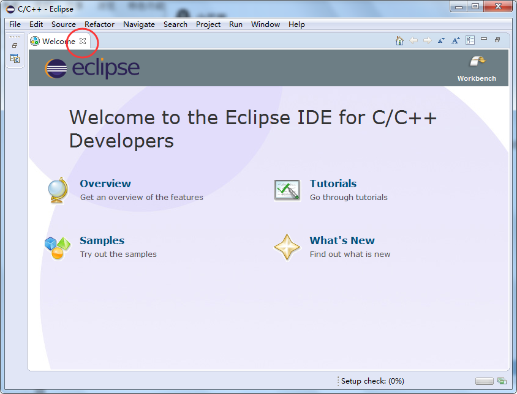


## 导入源码

选择`File` `Import` ，导入git工程到当前工作空间。

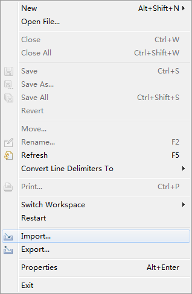

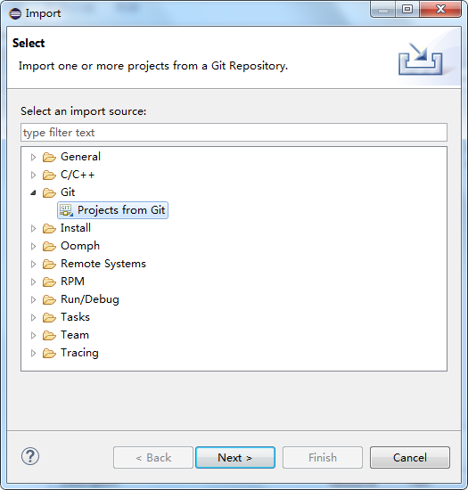

点击`Next` ，出现git仓库选择界面，这里可以选择存在的本地git仓库，或者网络git仓库，这里选择`Clone URI`。

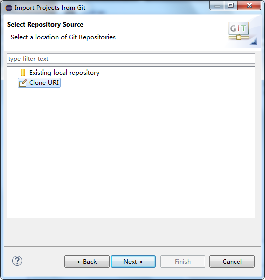

点击`Next`，出现填充仓库URI链接界面，这里填写`https://github.com/xboot/xboot.git`，其他内容会根据所填的URI自动完成。

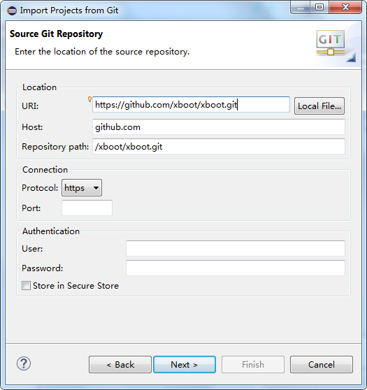

点击`Next`，出现远程仓库分支选择界面，勾选主分支`master`，可以全部勾选。

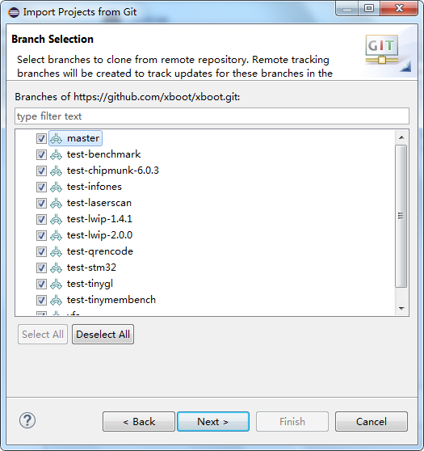

点击`Next`，选择目录及初始化分支，这里路径选择工作空间，然后初始化分支选择`master`主分支。

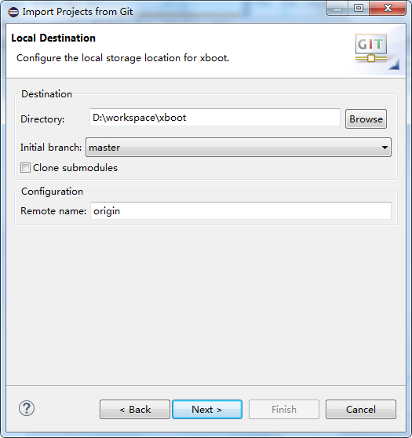

点击`Next`，从远程仓库克隆源码，这个过程比较久，请耐心等待。

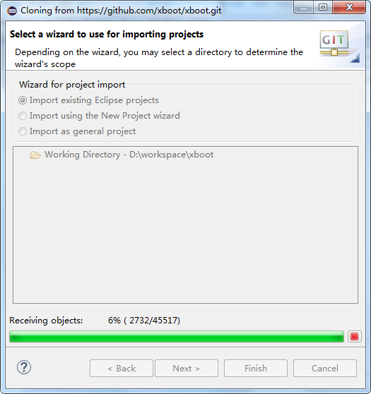

克隆完成后，弹出如下界面：


点击`Finish` ，完成xboot工程的导入步骤，如下图所示：

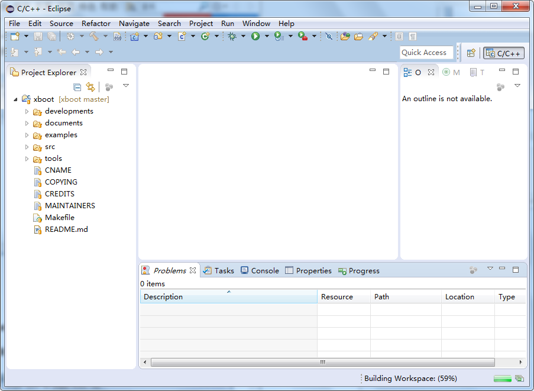

## 编译源码

首先，Makefile中有两个变量在编译时需要传递，一个是交叉工具链，另一个是具体的硬件平台

| 变量            | 说明                          |
| ------------- | --------------------------- |
| CROSS_COMPILE | 指定交叉工具链                     |
| PLATFORM      | 指定硬件平台，由两部分组成，`arch`及`mach` |

在编译前，需要修改默认的Makefile，以传递正确的`CROSS_COMPILE` 及`PLATFORM`，这里以`Realview`模拟器平台为例，修改后的Makefile，如下图所示：


点击菜单`Project` `Build all` 或者直接按快捷键`CTRL+B`编译整个源码。Windows平台编译速度较慢，请耐心等待。

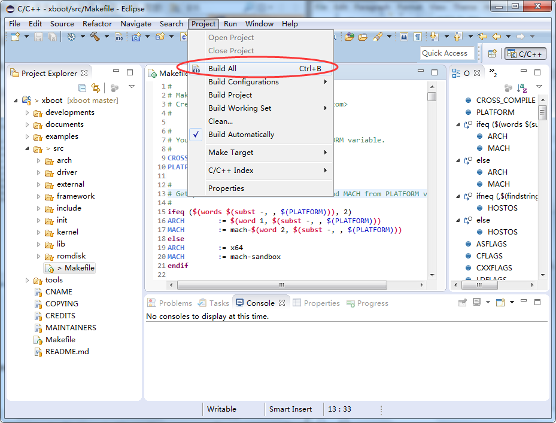

观察`Console`窗口，直至编译完成。


此时，在`output`目录下会生成`xboot.bin`等相关目标文件。

| 文件名       | 描述                      |
| --------- | ----------------------- |
| xboot     | 带有符号的ELF目标文件，模拟器直接加载此文件 |
| xboot.bin | 不带任何符号信息的二进制文件，一般作为烧写镜像 |
| xboot.map | 各个符号详细链接信息              |


## 运行

启动模拟器，双击`tools\qemu-system\windows`目录下的`realview-run.bat`脚本即可。


模拟器运行速度较慢，如需体验真实性能，请在真机上实验，实际效果如下图所示：


> 如果是Linux系统，在执行`realview-run.sh`脚本前，需确认当前系统是否已安装qemu-system-arm，如没有安装，以ubuntu为例，请执行如下指令：
```shell
sudo apt-get install qemu-system-arm
```

## 调试

在调试前，我们需要先修改`src\arch\arm32\mach-realview\xboot.mk`默认的编译参数，默认`-O3`优化选项，编译时，会优化掉很多有用的符号信息，不利于调试，这里改成`-O0`参数，禁止编译器做任何优化，在修改参数后，需要清除一下，再重新完整编译，具体修改如下图所示：

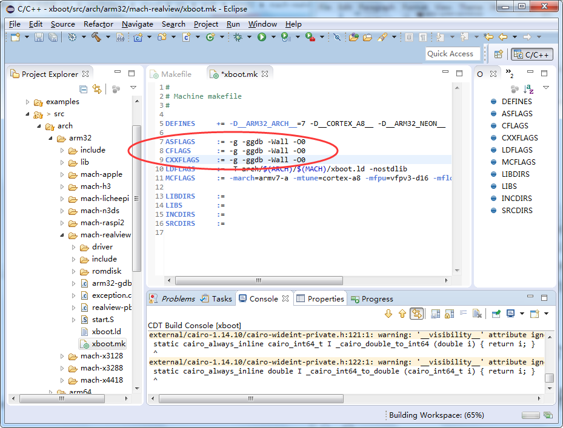

确认开发环境里是否已安装`GDB Hardware Debuging`插件，这个插件在`CDT`插件包里，如果没有安装，可以通过`Help` `Install new software`菜单来安装，如下图所示：


配置调试器，点击`Run` `Debug Configurations` ，然后双击`GDB Hardware Debugging`，按下图配置：


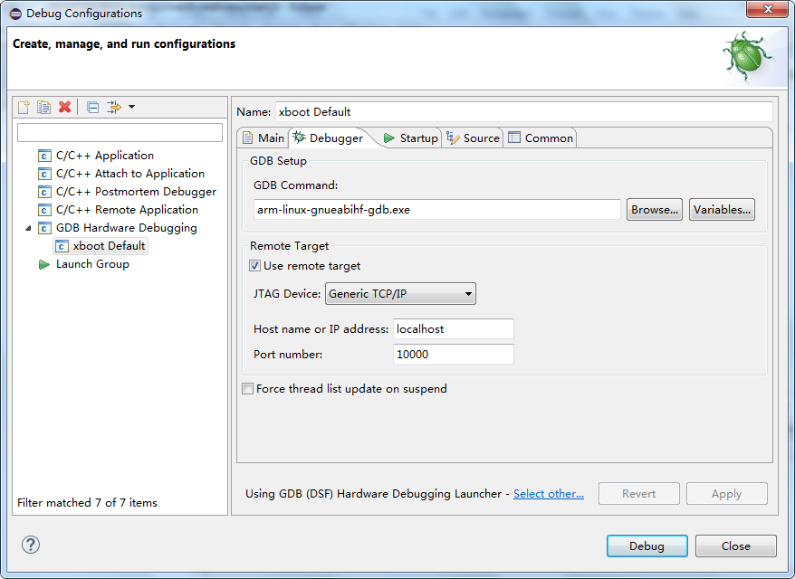

设置断点，可以直接双击源码左侧，这里我们设置`xboot_main`函数的断点。

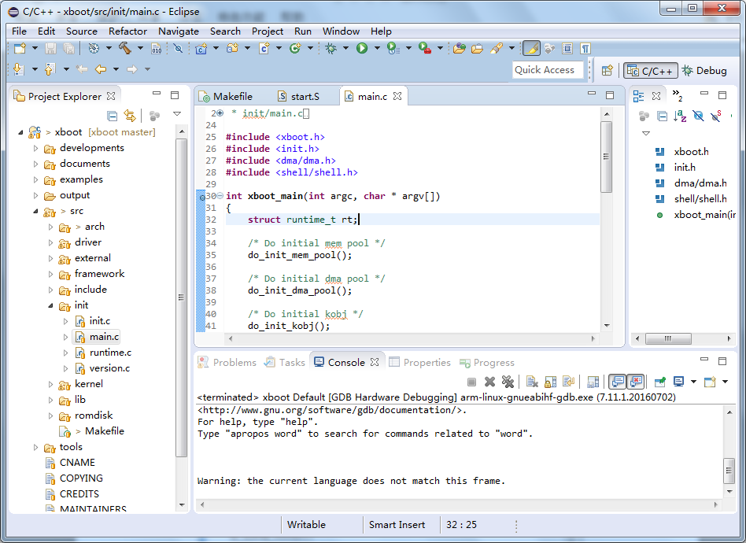

启动`GDB Server`，双击`tools\qemu-system\windows`目录下的`realview-dbg.bat`脚本即可。


运行GDB调试器，观察`Console`窗口输出


正常连接后，会出现如下调试界面，断点在`_start`处。


点击如下工具栏，可以运行，停止，单步，步过，跳出等基本操作。


点击运行，单步等命令按钮，就可以调试了，如下图所示：

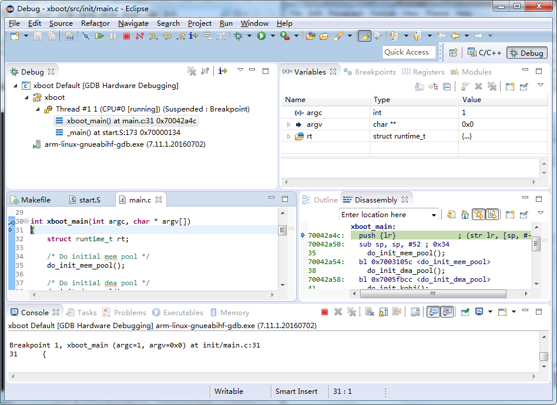

## 编译其他平台

Makefile中有两个变量在编译时需要传递，一个是交叉工具链，另一个是具体的硬件平台。

| 变量            | 说明                          |
| ------------- | --------------------------- |
| CROSS_COMPILE | 指定交叉工具链                     |
| PLATFORM      | 指定硬件平台，由两部分组成，`arch`及`mach` |

* ### Realview平台，qemu-system-arm模拟器

```shell
make clean
make CROSS_COMPILE=/path/to/arm-none-linux-gnueabihf- PLATFORM=arm32-realview
```

* ### 全志V3S，荔枝派(lichee-pi zero)

```shell
make clean
make CROSS_COMPILE=/path/to/arm-none-linux-gnueabihf- PLATFORM=arm32-v3s
```

* ### Raspberry PI 2代

```shell
make clean
make CROSS_COMPILE=/path/to/arm-none-linux-gnueabihf- PLATFORM=arm32-raspi2
```

* ### Raspberry PI 3代

```shell
make clean
make CROSS_COMPILE=/path/to/aarch64-none-elf- PLATFORM=arm64-raspi3
```

* ### X86_64位linux系统下的sandbox

sandbox依赖与SDL2库，在编译前需要安装libsdl2-dev，以ubuntu系统为例:
```shell
sudo apt-get install libsdl2-dev
```
```shell
make clean
make CROSS_COMPILE="" PLATFORM=x64-sandbox
```
